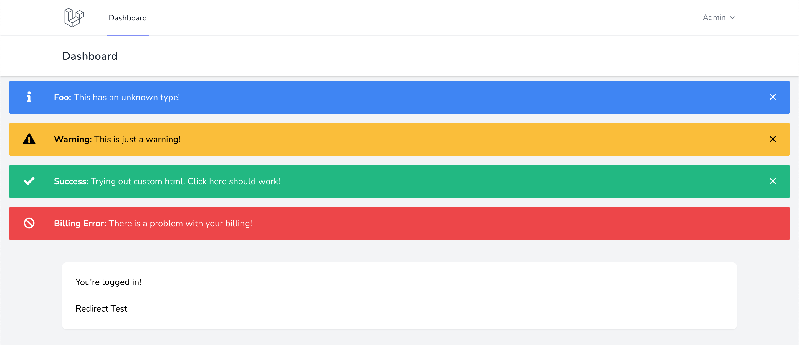
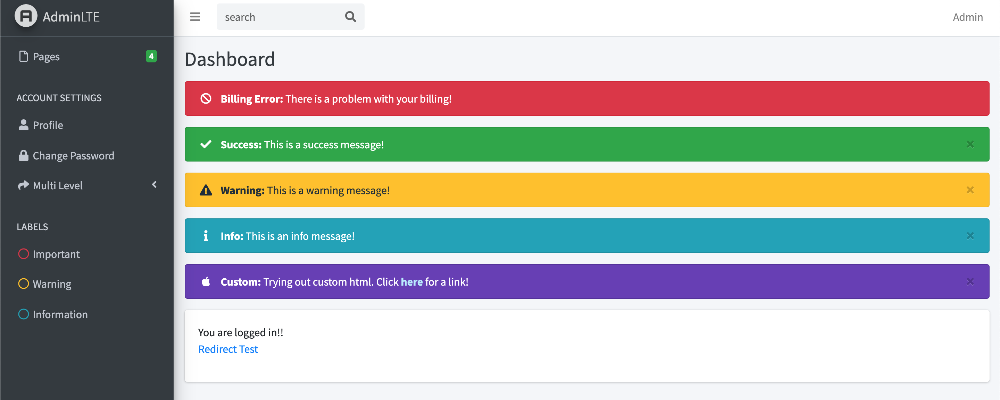

# Laravel Flash Messages

Add flash messages (alerts) to your Laravel project. Supports Tailwind v2, Bootstrap v4, Bootstrap v5, or any custom CSS you need.

This was built and tested on Laravel 8. So far it has not been tested on Laravel 7. If you try it, please let me know how it goes so I can update this readme :)

## Screenshots

### Laravel 8 with Breeze and Tailwind v2


### Laravel 8 with [AdminLTE](https://github.com/jeroennoten/Laravel-AdminLTE) and Bootstrap v4


## Table of Contents

 - [Warning](#warning)
 - [Installation](#installation)
   - [Tailwind v2](#tailwind-v2)
   - [Bootstrap v4](#bootstrap-v4)
   - [Bootstrap v5](#bootstrap-v5)
   - [Other CSS Templating](#other-css-templating)
 - [Installing Icons](#installing-icons)
   - [Install FontAwesome via CDN](#install-fontawesome-via-cdn)
   - [Install FontAwesome via NPM](#install-fontawesome-via-npm)
 - [Info about the view files](#info-about-the-view-files)
 - [Usage](#usage)
   - [Safely using user input/data](#safely-using-user-inputdata)
 - [Advanced Usage](#advanced-usage)
   - [Helper Functions](#helper-functions)
   - [Using HTML inside the message](#using-html-inside-the-message)
   - [Creating a new type](#creating-a-new-type)
   - [Individual Message Custom Configuration](#individual-message-custom-configuration)
   - [How to see the messages to modify the view files?](#how-to-see-the-messages-to-modify-the-view-files?)

## Warning

I want to ensure you see this warning message, which is why it is first and before the installation instructions.

**The `icon` and `message` will NOT be escaped/encoded.**

For the icon, this shouldn't be a problem since they are generated from the config and are an array map. However, you should be aware of it just in case you do (for some crazy reason) use user input in the icon passed to the individual message's config array.

For the message, in most cases, it shouldn't be a problem. This allows you to use HTML inside of the message itself, so you can include a link, underline or bold something, make a list, whatever you need.

You can use a user's data that is generated by your application, like their user id.

If, for some crazy reason, you do need to pass user input into the message, you SHOULD encode it using Laravel's `e()` helper function. Not the whole message, just the individual pieces of data you are inserting into it, like their name. If it's questionable, encode it. Read:[https://laravel.com/docs/8.x/blade#html-entity-encoding](https://laravel.com/docs/8.x/blade#html-entity-encoding)

Maybe there is a better way to handle this? I am fairly new to Laravel, so I am open to suggestions so we can do away with this warning.

## Installation

To install this package, run:

```
composer require wadeshuler/laravel-flashmessages
```

Place the code for the container component where you want the flash messages to appear.

```php
<x-flashmessages-container />
```

**Note:** If you want to display the flash messages on multiple different types of layouts, you will want to leave it alone and wrap a `<div>` around the call to the component. This way you can use a different wrapper on your login/register pages and your dashboard.

Example:

```php
<div class="auth-page-alert-wrapper">
    <x-flashmessages-container />
</div>
```

and

```php
<div class="dashboard-alert-wrapper">
    <x-flashmessages-container />
</div>
```

This package supports Tailwind v2 (comes with Laravel 8 by default), Bootstrap v4, and Bootstrap v5 out of the box.

Due to this flexibility, we can't load an appropriate config or view files by default. So you will get an error if you do not install them.

Follow the instructions below for the appropriate CSS environment you are using.

### Tailwind v2

Install the config file:

```
php artisan vendor:publish --provider="wadeshuler\FlashMessages\FlashMessagesProvider" --tag="tailwind2-config"
```

Install the view files:

```
php artisan vendor:publish --provider="wadeshuler\FlashMessages\FlashMessagesProvider" --tag="tailwind2-views"
```

### Bootstrap v4

Install the config file:

```
php artisan vendor:publish --provider="wadeshuler\FlashMessages\FlashMessagesProvider" --tag="bootstrap4-config"
```

Install the view files:

```
php artisan vendor:publish --provider="wadeshuler\FlashMessages\FlashMessagesProvider" --tag="bootstrap4-views"
```

### Bootstrap v5

Install the config file:

```
php artisan vendor:publish --provider="wadeshuler\FlashMessages\FlashMessagesProvider" --tag="bootstrap5-config"
```

Install the view files:

```
php artisan vendor:publish --provider="wadeshuler\FlashMessages\FlashMessagesProvider" --tag="bootstrap5-views"
```

### Other CSS Templating

If you are not using Bootstrap or Tailwind, then just pick any of them and modify the generated files however you need.

In the future when newer versions of Tailwind or Bootstrap are out, just choose the latest appropriate version and modify it if necessary. Depending on how much the future versions change, depends on how much you have to modify.

## Installing Icons

A stock Laravel 8 installation does not include FontAwesome, so the icons will not work. You are free to use whatever icons you want, you will just have to modify the config to use them. If you are using a 3rd party template of some kind, ensure that FontAwesome isn't already installed. You can simply try using an icon on a view file somewhere.

If you want to use FontAwesome, you must first install it. You have 2 options, CDN or NPM :)

### Install FontAwesome via CDN

In all of the layouts you want to use flash messages on, add the stylesheet to the head section:

```html
<link rel="stylesheet" href="https://cdnjs.cloudflare.com/ajax/libs/font-awesome/5.15.3/css/all.min.css" integrity="sha512-iBBXm8fW90+nuLcSKlbmrPcLa0OT92xO1BIsZ+ywDWZCvqsWgccV3gFoRBv0z+8dLJgyAHIhR35VZc2oM/gI1w==" crossorigin="anonymous" />
```

Then add the corresponding JavaScript file just before the closing body tag:

```html
<script src="https://cdnjs.cloudflare.com/ajax/libs/font-awesome/5.15.3/js/all.min.js" integrity="sha512-RXf+QSDCUQs5uwRKaDoXt55jygZZm2V++WUZduaU/Ui/9EGp3f/2KZVahFZBKGH0s774sd3HmrhUy+SgOFQLVQ==" crossorigin="anonymous"></script>
```

### Install FontAwesome via NPM

```
npm install @fortawesome/fontawesome-free --save-dev
```

Then import it in your `resources/css/app.css` file:

```css
@import '@fortawesome/fontawesome-free/css/fontawesome';
```

Require it in your `resources/js/app.js` file:

```js
require("@fortawesome/fontawesome-free/js/all");
```

Finally, run:

```
npm run dev
```

## Info about the view files

The view files will be published to `resources/views/vendor/flashmessages`.

**The container component blade file:** It is a container that holds the individual flash messages. It simply loops through all the flash messages and loads them each into their own components.

**The message component blade file:** The template for each flash message itself. There are a few helper functions available to assist with generating the message. Use the helper functions and do not echo the variables directly. The helper functions return an empty string if the value is not set (null).


## Usage

A Composer alias is made for the FlashMessages Facade so you don't have to import it manually, but you still can.

Use the backslash and you don't have to import it: `\FlashMessages::addFlashMessage($type, $message)`

Or, you can import it at the top of your class simply as: `use \FlashMessages;`

Or, you can import it like you do for everything else as: `use wadeshuler\FlashMessages\Facades\FlashMessages;`

Now all you have to do is add the flash message:

```php
\FlashMessages::addFlashMessage(
    'success',
    'This is a success message!',
);
```

You can also use the `flash()` macro on a redirect in your controller:

Example:

```php
return redirect(route('home'))->flash('success', 'This is a success message!', ['dismissable' => false]);
```

This will probably be the preferred method to use, unless you need to add more than 1 flash message.

### Safely using user input/data

Please read the big warning that is at the beginning of this README. The message is not encoded by blade's `{{ $message }}` rendering tags. The message is rendered using `{!! $message !!}` so HTML can be used.

If you need to pass user data into the message, here is how you can safely do it:

```php
\FlashMessages::addFlashMessage(
    'success',
    'Thank you ' . e($user->name) . ' for your payment!',
);
```

## Advanced Usage

### Add Flash Message Now

In addition to the `addFlashMessage()`, there is also `addFlashMessageNow()` to render messages for immediate use. It
utilizes Laravel's `request()->session()->now()`, which allows you to add a flash message and display it on the same
page load.

I added this because I wanted to convert the built in status messages to nice Bootstrap alerts (flash messages). For
example: When email verification is enabled, Laravel returns a `verification-link-sent` status. This isn't very easy
to work with. At this point, the page has already loaded and or been redirected to wherever it's supposed to go. Since
the page has already loaded, if we use `addFlashMessage()` at this point, the flash message will display on this page
load AND the next. That is a problem, the message shouldn't be shown on the next subsequent page.

To solve this, we can use `addFlashMessageNow()` instead:

```php
\FlashMessages::addFlashMessageNow(
    'success',
    'A verification link has been emailed to you!',
);
```

I wrote a middleware that simply detects all of the generic Laravel and Fortify "statuses" and converts them to flash
messages, with two separate arrays for regular flash messages, and ones that should be called with "now". I plan on
adding it to this package later.

### Helper Functions

There is 1 app level helper function to determine if there are any flash messages. This is useful if you have wrapped the call to the component with a div and it is creating spacing issues.

```php
@if ( hasFlashMessages() )
    <div class="my-2 mx-4">
        <x-flashmessages-container />
    </div>
@endif
```

There are also 9 `FlashMessages` helpers available for use within the `resources/views/vendor/flashmessages/components/message.blade.php` file. You can see an example of most of these inside this blade file.

 - `isDismissable()` - (bool) Determine if the flash message is dismissable.
 - `getClass()` - Get the class name determined from `typeToClassMap` or the default if unknown.
 - `shouldShowIcon()` - (bool) Determine if the icon should be shown.
 - `getIcon()` - Get the icon determined from `typeToIconMap` or default if unknown.
 - `shouldShowTitle()` - (bool) Determine if the title should be shown.
 - `hasTitle()` - (bool) Determine if the flash message has a title.
 - `getTitle()` - Get the title.
 - `hasMessage()` - Determine if the flash message has a message (it should, but added just in case).
 - `getMessage()` - Get the message.

### Using HTML inside the message

You can pass HTML to the message if you need to.

Here is how you can pass a link in the message:

```php
\FlashMessages::addFlashMessage(
    'error',
    'Your subscription has expired. Click <a href="https://www.google.com" class="alert-link">here</a> to renew!',
);
```

**Note:** `alert-link` is a Bootstrap class that makes the link color match the type/color of the alert. It isn't necessary if you aren't using Bootstrap. If you use Bootstrap and create your own custom types, you may want to also create the CSS for these as well.

### Creating a new type

Creating a new type is very easy.

Add your icon's HTML to the `typeToIconMap` array in `config/flashmessages.php`:

```php
'typeToIconMap' => [
    'foo' => '<i class="fab fa-fw fa-apple mr-2"></i>',
],
```

For FontAwesome, I like to use the `fa-fw` class. This makes the icons all have the same width and it looks better overall. Especially when you show multiple messages on the screen.

Then add your class to the `typeToClassMap` array, also in `config/flashmessages.php`:

```php
'typeToClassMap' => [
    'foo' => 'custom-class',
],
```

**Note:** If you are using Bootstrap, the class will be added to the alert prefix as `alert-custom-class`

Don't forget to create the CSS for your custom class:

```css
.alert-custom-class {
    color: #fff;
    background: #673ab7;
    border-color: #552d9c;
}

.alert-custom-class .alert-link {
    color: #b8ebff;
    text-decoration: none;
}
```

Add your hover/active/visited effects if you want. You may be using mix or SASS instead of CSS. Do it properly and not a custom hack by throwing a style tag in the layout... Don't forget to run `npm run dev` if you need to, to re-compile the CSS you just added.

### Individual Message Custom Configuration

The `addFlashMessage()` method supports a 3rd argument, a `$config` array. Most of the available options can be passed to the individual message's config array. However, you can not pass `message`, `typeToIconMap`, or `typeToClassMap`.

Example:

```php
\FlashMessages::addFlashMessage(
    'success',
    'This is a highly configured success message!',
    [
        // common config options
        'title' => 'Custom Title',
        'class' => 'custom-classname',           // if you want to use a different class for this message
        'icon'  => '<i class="fas fa-fw fa-taxi"></i>',// if you want to use a different icon for this message

        // rare config options (set in default config and rarely have to change)
        'showIcon'    => true,                   // override the default config values
        'showTitle'   => false,                  // override the default config values
        'dismissable' => false,                  // override the default config values

        // In the VERY RARE event you need to override the "forced" settings (defined in config)
        // This allows you to override the override for this individual message itself

        // very rare config options
        'forceIcon' => false,                    // override `forceIcon` (if enabled in config)
        'forceTitle'  => false,                  // override `forceTitle` (if enabled in config)
        'forceDismissable'  => false,            // override `forceDismissable` (if enabled in config)
    ],
);
```


## How to see the messages to modify the view files?

In order to edit the container or the message view files, you probably will need to be able to see at least 1 flash message so you can test it.

Create a route:

```php
Route::get('/redirect-test', [App\Http\Controllers\Controller::class, 'redirectTest'])->name('redirect.test');
```

Change `Controller` to an appropriate controller. Any one will do, but probably whichever one is your main controller that renders your dashboard.

Add the test function to that controller:

```php
public function redirectTest(\Request $request)
{
    \FlashMessages::addFlashMessage(
        'success',
        'This is a success message!',
    );

    \FlashMessages::addFlashMessage(
        'warning',
        'This is a warning message!',
    );

    \FlashMessages::addFlashMessage(
        'info',
        'This is an info message!',
    );

    \FlashMessages::addFlashMessage(
        'error',
        'This is an error message!',
        [
            'title' => 'Custom Error Title',
            'dismissable' => false,
        ]
    );

    // Let's also ensure a message with an undefined type looks fine while we are here
    \FlashMessages::addFlashMessage(
        'foo',                              // some type that does not exist, falls back to default class/icon
        'This is an error message!',
    );

    return redirect(route('home'));     // change home to whatever named route you need (ie: dashboard)
}
```
